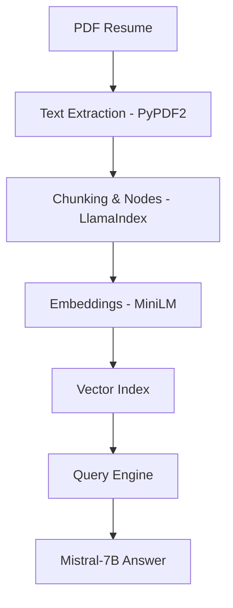

# 📄 Resume & Job Description Q&A Assistant using RAG

A **Retrieval-Augmented Generation (RAG)** based Question–Answering assistant that allows you to ask questions about a resume (PDF) and get accurate answers grounded strictly in the document content.

This project demonstrates an end-to-end RAG architecture optimized for efficiency and cost-effectiveness.

## 🚀 Project Highlights

* 📄 **Extracts text** from resume PDFs using PyPDF2.
* ✂️ **Automatically chunks** large documents for better retrieval accuracy.
* 🔢 **Converts text into vector embeddings** using lightweight models.
* 🧠 **Performs semantic search** using vector similarity.
* 🤖 **Uses Mistral-7B** to generate context-aware, grounded answers.
* 💰 **No paid APIs required** (100% open-source).
* ⚡ **Runs on free Colab GPU** using 4-bit quantization.

---

## 🧠 What is RAG in this Project?

RAG (Retrieval-Augmented Generation) ensures the LLM provides factual answers by following this pipeline:

1. **User Query**
2. **Query Embedding** (Turning the question into numbers)
3. **Vector Search** (Retrieving the Top-K relevant chunks from the resume)
4. **Prompt Construction** (Combining the Context + Question)
5. **LLM Generation** (Generating the final answer)

👉 **The LLM does NOT hallucinate** — it answers strictly using the retrieved resume content.

---

## 🧱 Architecture Overview



---

## 📂 Project Structure

```text
RAG-Resume-QA/
│
├── data/
│   └── Vishal-Yadav.pdf    # Your Resume PDF
│
├── app.py                  # Main application script
├── requirements.txt        # Python dependencies
└── README.md               # Project documentation

```

---

## 🛠️ Tech Stack

| Component | Tool / Framework |
| --- | --- |
| **Framework** | LlamaIndex |
| **Embeddings** | `sentence-transformers/all-MiniLM-L6-v2` |
| **LLM** | `Mistral-7B-Instruct-v0.3` |
| **Quantization** | BitsAndBytes (4-bit) |
| **PDF Parsing** | PyPDF2 |
| **Runtime** | Google Colab (T4 GPU) |

---

## 📦 Installation

### 1️⃣ Create Environment (Optional)

```bash
conda create -n rag python=3.10
conda activate rag

```

### 2️⃣ Install Dependencies

```bash
pip install -r requirements.txt

```

### 3️⃣ (Optional) Hugging Face Login

Required if the model is gated or to access private repositories.

```python
from huggingface_hub import login
login()

```

---

## ▶️ How to Run

### 1️⃣ Upload Resume PDF

Place your resume inside the `data/` folder and update the path in `app.py`:

```python
PDF_PATH = "data/Vishal-Yadav.pdf"

```

### 2️⃣ Run the Script

```bash
python app.py

```

---

## 💬 Example Queries

* "List all the skills mentioned in this resume."
* "What is the email address in this resume?"
* "What technologies does the candidate work with?"
* "Summarize the professional experience."

### 📌 Sample Output

> **📝 Query:** List all the skills mentioned in this resume.
> ## **✅ Response (1.32s):**
> 
> 
> ## The candidate has experience in Python, SQL, Machine Learning, Data Analysis, Pandas, NumPy, and Deep Learning.
> 
> 

---

## ⚙️ Key Configurations

* **CHUNK_SIZE = 512**: Smaller chunks improve retrieval granularity.
* **CHUNK_OVERLAP = 50**: Ensures context is preserved across chunk boundaries.
* **TOP_K = 3**: Determines how many relevant snippets are sent to the LLM.

---

## 🔐 Cost & Privacy

* ❌ **No OpenAI API**: Completely free to use.
* ❌ **No paid services**: Utilizes open-source models and free compute.
* ✅ **Fully offline**: After the initial model download, no data is sent to external APIs.
* ✅ **Privacy**: Your resume data stays within your specific environment.

---

## 🎯 Learning Outcomes

* Understanding the internal mechanics of **Semantic Search**.
* Mastering **vector embeddings** and document indexing.
* Optimizing LLMs for **low-latency** on consumer/free hardware.
* Building production-ready RAG prompts.

---

## 🔮 Future Enhancements

* [ ] Add Job Description matching (Resume-JD Similarity Scoring).
* [ ] Integrate **FAISS** or **Pinecone** for larger scale retrieval.
* [ ] Support for `.docx` and multiple PDFs.
* [ ] Build a **Streamlit** user interface.
* [ ] Add **Reranking** (Cross-Encoders) for higher accuracy.

---

## 👨‍💻 Author

**Vishal Yadav** *Aspiring Data Scientist & GenAI Engineer* 📍 Pune, India

⭐ **If you found this useful, give the repository a star and feel free to fork or extend it!**
